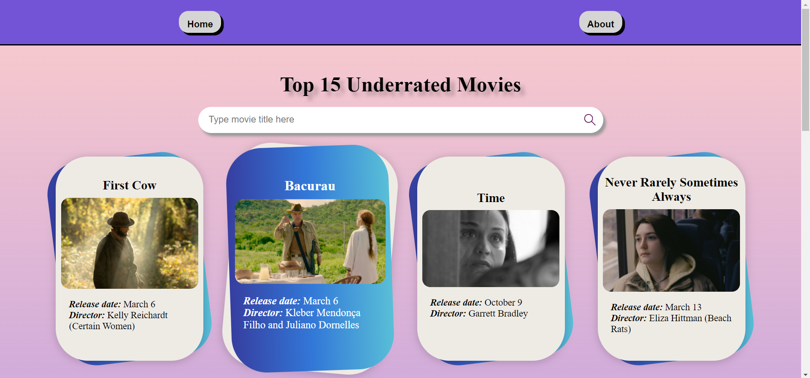
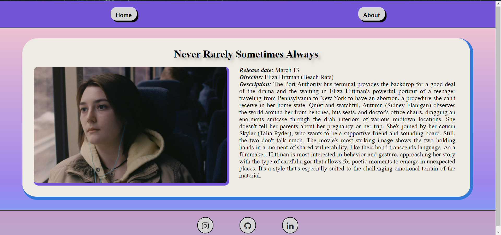
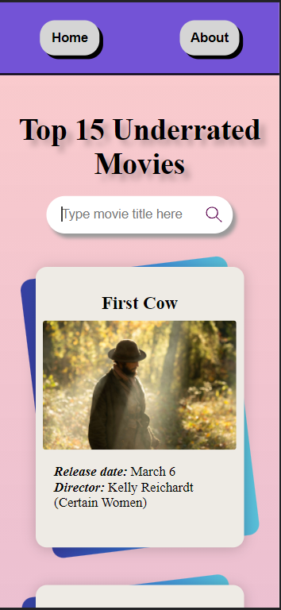
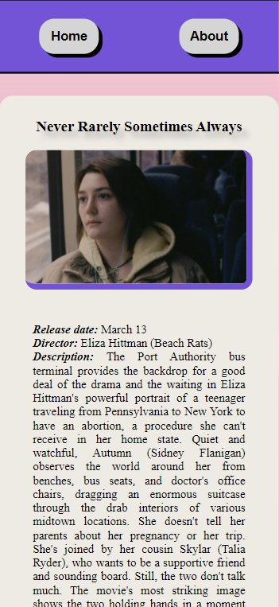

# Single Page Application Vanilla TypeScript

## Table of Contents
  - [Table of Contents](#table-of-contents)
  - [Description](#description)
  - [Screenshots](#screenshots)
  - [Setup](#setup)
  - [Usage](#usage)
  - [Acknowledgements](#acknowledgements)
  - [Developer](#developer)

## Description
> This project is a single page application website which an app with only 1 page HTML. The HTML is injected different codes when the user accesses different pages. This project is developed using TypeScript and without any framework, so I call it Vanilla TypeScript :D. You can access this website on the [github page](https://malikrafsan.github.io/Single-Page-Application-Vanilla-TypeScript/)

## Screenshots





## Setup
In order to run this website, you need to install:
1. NodeJS
    - You can find installation guide [here](https://nodejs.org/en/download/)
    - Here we don't use NodeJS, but we need it in order to install TypeScript
2. TypeScript
    - You can install TypeScript by using:
      ```
      npm install typescript --save-dev
      ```

## Usage
You can run this website by:
1. Compile TypeScript files, by using this command
   ```sh
   tsc
   ```
2. Open the `index.html` by using live server or just open it using file explorer

Or you can just access on the [github page](https://malikrafsan.github.io/Single-Page-Application-Vanilla-TypeScript/)


## Acknowledgements
> This project is developed for Google Developer Student Club (GDSC) Institut Teknologi Bandung (ITB)

## Developer
> Malik Akbar Hashemi Rafsanjani